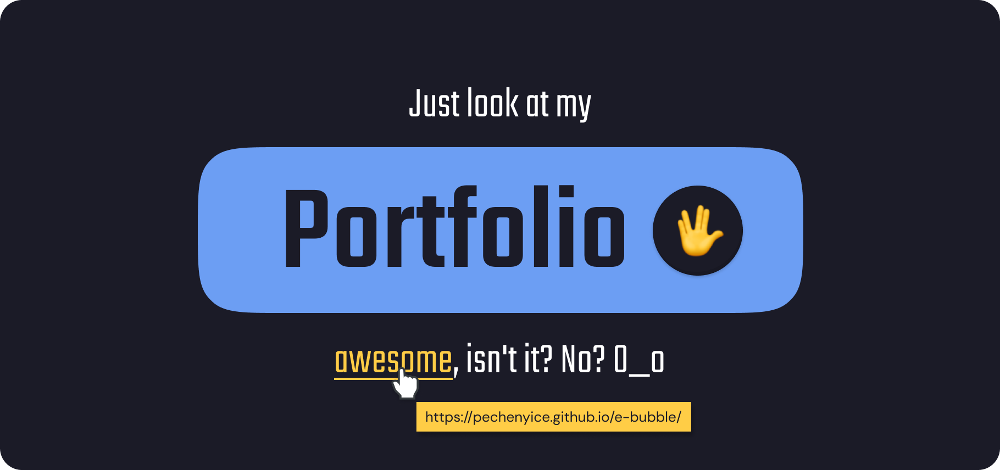

# Hi there 

### I am German Iskhakov, forever young student from Russia. BTW I am frontend developer.

 **Study roadmap**: React Native, Kubernetes, GraphQL, Linux, CI/CD
  **Retrospective**: JavaScript, React (and small local implementation), Next.js, Webpack, TypeScript, Redux, MySQL, RabbitMQ, Node.js, CSS-preprocessors, Docker, Electron, REST, RPC, Unit testing with jest, enzyme and React Testing library, Auto testing with Puppeteer and Cypress (ye-a, almoust fullstack, u know?)

 My links u could find on portfolio site 👇

## 🤡 About

- 🏁 I just finished [Clio Quartet landing](https://github.com/Pechenyice/quartetLanding) project, view [deployment](https://pechenyice.github.io/quartetLanding/)
- 🔭 I’m currently working on my [diplom project](https://github.com/Pechenyice/diplomWeb)
- 🌱 I’m currently learning to work with Linux
- 🌱 I’m currently trying to read articles about React from the inside
- 💬 Ask me about how to write bad code, i am good at it :)
- ⚡ I just got as a gift a personal duck Gennady

## 🥇 Statistic & Information

 

 

## 🔥 Portfolio

 

 

